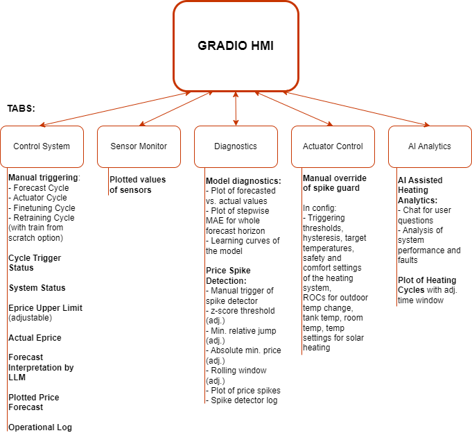
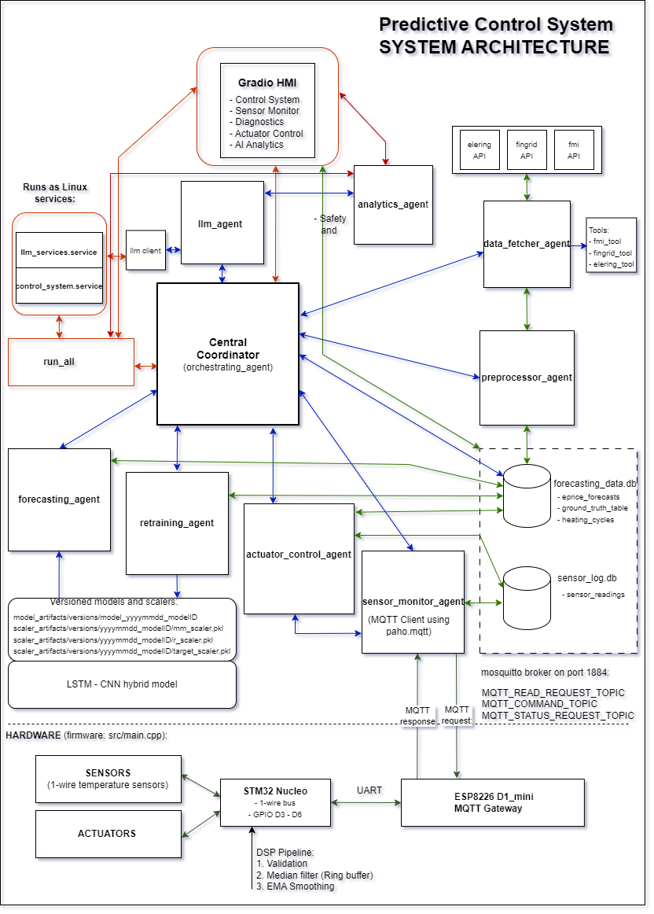
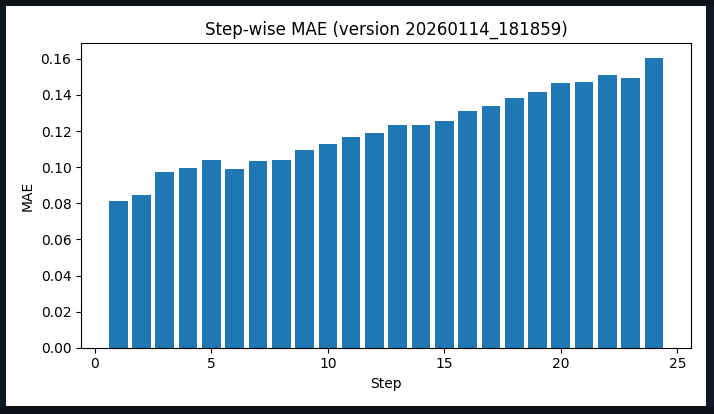
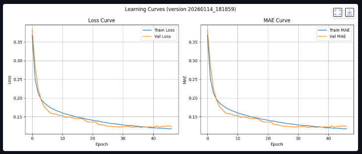

[](LICENSE)


# PREDICTIVE HEATING CONTROL SYSTEM

# OVERVIEW

The Predictive Heating Control System is an end-to-end, agent-based control platform designed to optimize energy usage in complex heating environments through predictive, data-driven decision-making.

The system is intentionally designed as a hybrid architecture that combines:

- Deterministic, rule-based control logic for safety-critical and comfort-critical decisions, and
- Forecast-driven intelligence powered by deep learning models and AI-assisted analytics.

This hybrid approach ensures that the system remains robust, explainable, and safe, while still benefiting from anticipatory control made possible by forecasting electricity prices, weather conditions, and system dynamics. Rather than replacing classical control logic, machine learning is used where it provides clear value: improving timing, cost efficiency, and long-term optimization.

The platform provides full-stack visibility across the entire control loop—from physical sensors and embedded hardware, through data acquisition and forecasting, to real-time actuator decisions and a human-machine interface (HMI). This transparency makes the system suitable not only for operational use, but also for validation, experimentation, and further research.



While the current implementation targets residential and small-scale commercial heating systems with heterogeneous heat sources, the architecture is domain-agnostic by design. The same predictive, agent-based control principles can be applied to other resource-optimization problems where anticipatory control outperforms purely reactive strategies.

# LICENSE AND INTENT

This project is released under the MIT License.

The MIT License was intentionally chosen to:

- Encourage open review and technical discussion
- Allow reuse, experimentation, and adaptation without restrictive barriers
- Make the project accessible to recruiters, researchers, and potential business partners

The goal of publishing this codebase is to demonstrate system-level engineering, applied machine learning, and real-world control design in a transparent and practical way. The license reflects an intention to keep the project open for learning, collaboration, and potential commercial dialogue, while clearly disclaiming warranty or operational liability.

See the full license text in 

# 1. SYSTEM ARCHITECTURE

The system uses a multi-agent architecture coordinated by a central orchestrating_agent. This orchestrator manages execution order, system state, and failure handling while delegating specialized tasks to independent agents.

The platform runs as two persistent Linux system services:
- control_system.service
- llm_systems.service

This design ensures high availability and automatic recovery after power interruptions or system restarts.



## Core Agents
| Agent                      | Responsibility                                      |
| -------------------------- | --------------------------------------------------- |
| **orchestrating_agent**    | Central coordinator and state manager               |
| **sensor_monitor_agent**   | MQTT-based real-time sensor acquisition             |
| **data_fetcher_agent**     | External API ingestion (prices, weather, forecasts) |
| **preprocessor_agent**     | Data cleaning, alignment, and feature preparation   |
| **forecasting_agent**      | Rolling multi-step electricity price forecasting    |
| **retraining_agent**       | Partial or full model retraining and versioning     |
| **actuator_control_agent** | Deterministic + predictive control logic            |
| **llm_agent**              | Human-readable forecast interpretations             |
| **analytics_agent**        | Human-readable explanations and fault diagnostics   |


# 2. DATA ACQUISITION

## 2.1 External APIs

The data_fetcher_agent retrieves:

- Day-ahead electricity prices (15-minute resolution) via the Elering API
- Wind energy production forecasts (15-minute resolution) via the Fingrid API
- Weather forecasts (10-minute resolution) via the FMI API

The data is resampled, cleaned, merged, and stored in ground_truth_table within forecasting_data.db by preprocessor_agent.

## 2.2 Real-Time Sensor Data

The sensor_monitor_agent communicates via MQTT (Mosquitto broker, paho.mqtt) and periodically requests sensor readings according to schedules defined in config.py.

Sensor data is stored in sensor_log.db with:
- sensor key
- sensor ID
- timestamp
- value

See Hardware Setup for details.

# 3. THE FORECASTER MODEL

Electricity prices are forecasted using a hybrid LSTM–CNN model:
- LSTM layers capture longer-term temporal patterns
- CNN layers improve short-term responsiveness
- Feature scaling uses a combination of Min-Max and Robust scalers
- Logarithmic feature transforms improve numerical stability

Models and scalers are versioned and persisted, enabling reproducibility and rollback.

After retraining, the following diagnostics are automatically stored and visualized:

- Training loss and MAE curves
- Stepwise MAE over the full forecast horizon
- Forecast vs. actual comparison plots







# 4. THE FORECASTING CYCLE

The forecasting_agent runs hourly and produces a 24-step forecast (6 hours at 15-minute resolution).

All forecast vintages are stored in eprice_forecasts for diagnostics.
A “shortest lead-time wins” selection is used to derive the best forecast for UI visualization and interpretation.

# 5. ACTUATOR CONTROL CYCLE

The actuator_control_agent executes decisions based on:

## 5.1 Current Electricity Price

- Derived from ground_truth_table
- Exact interval match preferred, fallback to latest known value

## 5.2 Safety Constraints

- Maximum tank temperature cutoff
- Deterministic overrides always take precedence

## 5.3 Averaged Future Price (Hybrid)

- Known day-ahead prices (actuals)
- Forecasted prices used only beyond known market data
- Forecasts aggregated using weighted median, where early vintages are down-weighted 

## 5.4 Rate-of-Change (ROC) Guards

- Tank temperature
- Room temperature
- Outdoor temperature

## 5.5 Price Spike Detection

- Robust statistical detection
- Classified as mild or strong
- Strong spikes trigger protective overrides

# 6. HARDWARE SETUP

## 6.1 The reference implementation uses:

- DS18B20 temperature sensors
- STM32 Nucleo board for sensor acquisition with 3-layer DSP pipeline
- ESP8266 (D1 Mini) as Wi-Fi gateway
- MQTT for communication
- Relay-based actuator simulation

- Temperature sensors
    - Outdoor temperature
    - Tank lower temperature
    - Tank upper temperature
    - Room temperature

- Actuators
    - Ground-source heat pump (GSHP)
    - Electric heater element
    - Circulation pump
    - Solar circulation (optional)

## 6.2 Communication

- MQTT broker: Mosquitto (local or networked)
- Transport: Wi-Fi or Ethernet
- Pattern:
    - SensorMonitor → periodic read requests
    - Embedded devices → publish sensor values
    - ActuatorControl → publish control commands

This decoupled design allows the software stack to evolve independently of the physical hardware and supports incremental expansion of sensors or actuators. See also mqtt_topic_map.md

# 7. GETTING STARTED

## 7.1 Requirements

The system is designed to run on a Linux-based host (e.g. a small server, NUC, or SBC) with the following requirements:
- Python 3.10+
- SQLite3
- Mosquitto MQTT broker
- Network access to external APIs (Elering, Fingrid, FMI)
- Optional GPU support for model training (CPU-only is supported)

## 7.2 Basic Setup

git clone git@github.com:tuohitorvi/predictive-heating-control.git
cd predictive-heating-control
pip install -r requirements.txt

Configure:
- config.py
- MQTT broker settings
- API credentials


# 8. WHY PREDICTIVE CONTROL?

Reactive control optimizes only for the present.
Predictive control optimizes across time.

By anticipating:
- price spikes,
- low-cost windows,
- environmental changes,

The system can shift energy consumption, reduce costs, and improve stability—without sacrificing safety or comfort.

The Predictive Heating Control System addresses these limitations by introducing anticipatory decision-making:

- Cost optimization: Heating decisions account for future electricity prices, not just the current price.
- Thermal inertia utilization: The system can preheat when energy is cheap and coast during expensive periods.
- Risk-aware forecasting: Forecast uncertainty is explicitly handled using forecast vintages and weighted aggregation, preventing overconfidence in early predictions.
- Safety and comfort preservation: Predictive logic is always subordinate to safety constraints (temperature limits, ROC guards) and comfort requirements.
- Explainability and observability: Every decision can be traced back through forecasts, inputs, and control logic, enabling validation and continuous improvement.


Although this project focuses on heating control, the same architecture applies to any domain where:

- Decisions have delayed effects
- Future conditions can be forecasted
- Resource efficiency matters

Examples include energy storage management, demand-response systems, industrial process control, and smart-grid optimization.


# 9. CONFIGURATION REFERENCE

The system behavior is primarily configured via config.py. Below are the most important configuration groups and parameters.

## 9.1 Scheduling and Timing

| Parameter               | Description                                                                 |
|-------------------------|-----------------------------------------------------------------------------|
| FORECAST_LOOKBACK_DAYS  | Number of historical days always fetched to ensure sufficient training and forecasting context |
| FORECAST_HORIZON        | Number of future timesteps forecasted (default: 24 × 15 min = 6 hours)      |
| SEQUENCE_LENGTH         | Input sequence length for the forecaster (default: 672 timesteps = 7 days)  |
| TIME_COLUMN             | Canonical datetime column name (UTC)                                        |
| LOCAL_TIME_ZONE         | Local timezone for display and interpretation (e.g. Europe/Helsinki)        |

## 9.2 Databases
| Parameter               | Description                                                                 |
|-------------------------|-----------------------------------------------------------------------------|
|FORECASTING_DB_PATH      |	SQLite DB storing forecasts, ground truth, diagnostics                      |
|GROUND_TRUTH_TABLE       |	Merged table of historical + day-ahead real prices and features             |
|SENSOR_DB_PATH           |	SQLite DB for raw sensor readings                                           |

## 9.3 Control Thresholds
|Parameter                  | Description                                                               |
|---------------------------|---------------------------------------------------------------------------|
|TANK_TEMP_UPPER_MAX        | Hard safety cutoff for upper tank temperature                             |
|TANK_TARGET_TEMP_UPPER     | Nominal tank target temperature                                           |
|TANK_HYSTERESIS	        | Temperature hysteresis band                                               |
|ROOM_TARGET_TEMP           | Target room temperature                                                   |
|ROOM_HYSTERESIS            | Room temperature hysteresis                                               |
|EPRICE_UPPER_LIMIT         | Price ceiling above which heating is disabled                             |
|EPRICE_VERY_LOW_THRESHOLD  | Price threshold that forces heating regardless of tank state              |

## 9.4 Rate-of-Change (ROC) Guards
|Parameter                              | Description                           |
|---------------------------------------|---------------------------------------|
|TANK_ROC_WINDOW_SECONDS                | Window for tank ROC evaluation        |
|TANK_ROC_THRESHOLD_C_PER_SEC           | Tank cooling threshold                |
|ROOM_ROC_COOL_THRESHOLD_C_PER_SEC      | Room cooling threshold                |
|OUTDOOR_ROC_COOL_THRESHOLD_C_PER_SEC   | Outdoor temperature cooling threshold |

## 9.5 Forecast Usage Parameters
|Parameter                  | Description                                                               |
|---------------------------|---------------------------------------------------------------------------|
|FORECAST_WEIGHT_SATURATION | Number of vintages required for full forecast weight (default logic: 3)   |
|FORECAST_AGG_METHOD        | Aggregation method (median used for robustness)                           |


# 10. CITATION


If you use this project in academic research, please cite it using the following BibTeX entry:


```bibtex
@software{predictive_heating_control_2026,
  author = {Martti Savolainen},
  title  = {Predictive Heating Control System},
  year   = {2026},
  url    = {git@github.com:tuohitorvi/predictive-heating-control.git}
}
```

For non-academic references, please cite as:
Martti Savolainen, Predictive Heating Control System, GitHub repository, 2026. Available at: git@github.com:tuohitorvi/predictive-heating-control.git

# DISCLAIMER

This software is provided for research and development purposes.
Users are responsible for validating safety, compliance, and operational suitability before deployment in real systems.