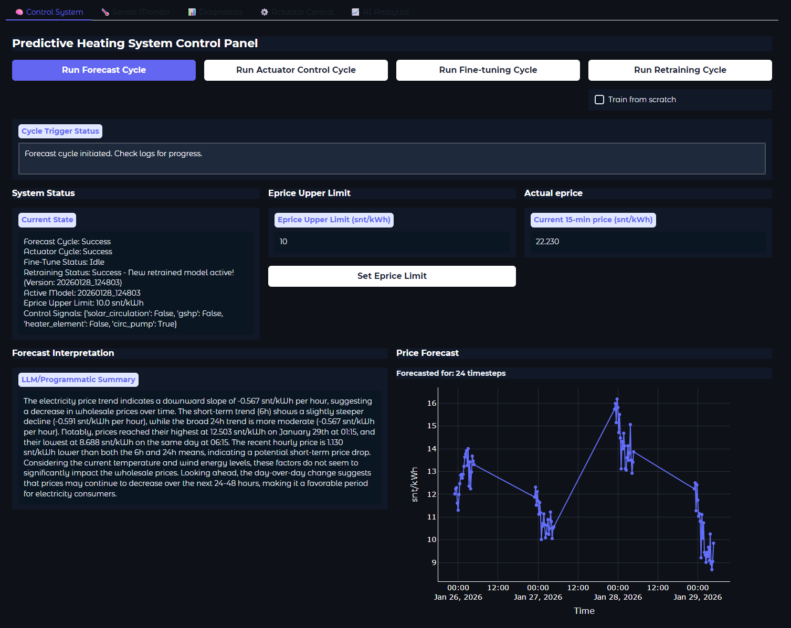
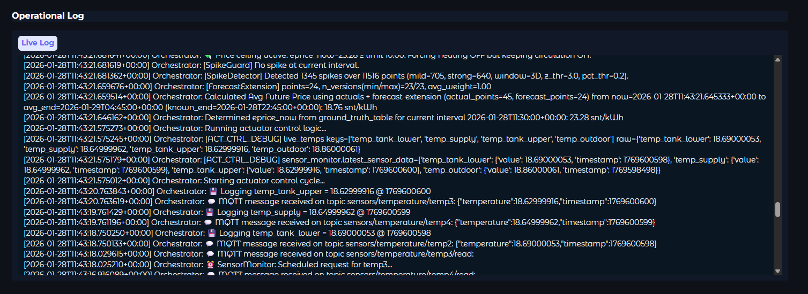
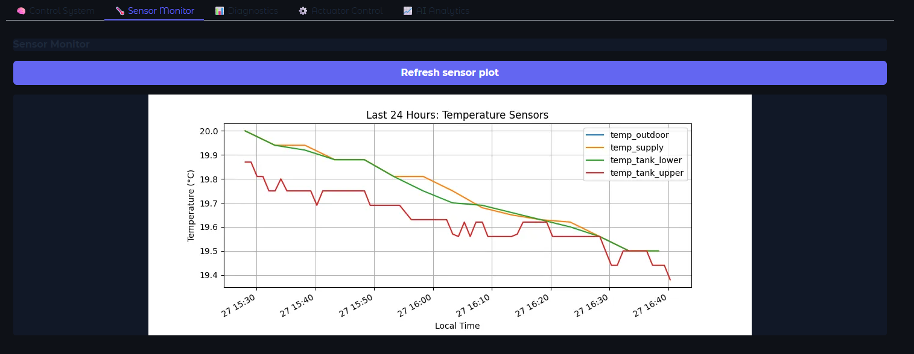
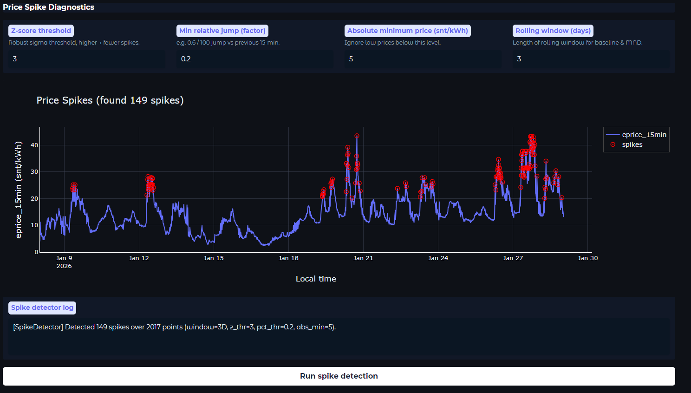
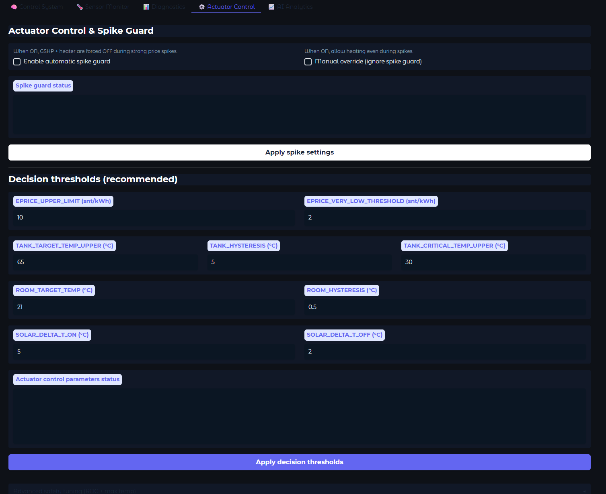
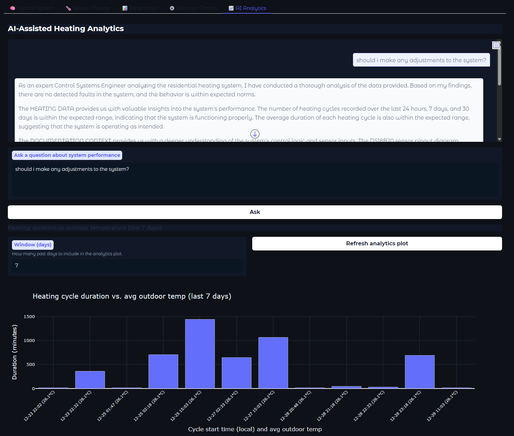

# UI Guide (Gradio Control Panel)

The UI is implemented in `run_all.py` using **Gradio** for the frontend and **FastAPI** for backend endpoints.  
Runtime ports:
- FastAPI: `http://localhost:5000`
- Gradio UI: `http://localhost:7860`

The UI is designed for:
- triggering orchestration cycles on demand
- monitoring system status and live logs
- visualizing forecasts and diagnostics
- managing spike-guard safety controls
- reviewing sensor history
- interacting with AI-assisted analytics

---

## UI Architecture (How the UI works)

### Frontend (Gradio)
The Gradio app is launched by `launch_gradio()` and runs at port **7860**.  
It contains five main tabs:

1. **Control System**
2. **Sensor Monitor**
3. **Diagnostics**
4. **Actuator Control**
5. **AI Analytics**

The UI refreshes dynamic views by polling backend state periodically using:
- `gr.Timer(5)` → `update_orchestrator_display()`

### Backend (FastAPI)
FastAPI endpoints are defined in `run_all.py` and served on port **5000**.  
The UI primarily interacts with:

- `GET /orchestrator/status`
- `POST /orchestrator/run_cycle`
- `POST /orchestrator/run_actuator_control_cycle`
- `POST /orchestrator/run_finetune`
- `POST /orchestrator/run_retraining`
- `POST /orchestrator/set_eprice_upper_limit`
- `POST /orchestrator/set_spike_guard`
- `POST /orchestrator/set_spike_override`
- Sensor data endpoints (`/sensors`, `/sensor_history/{sensor_key}`)

---

## UI Walkthrough with Screenshots

This section provides a visual overview of each UI tab and the operational workflow supported by the interface.

### 1. Control System Tab
Primary operator panel for triggering system cycles and reviewing current state.

Key functions:
- Trigger Forecast Cycle, Actuator Control Cycle, Fine-tuning, and Retraining (optionally from scratch).
- Set **Eprice Upper Limit** used by actuator control logic.
- View current system summary, control signals, and operational log.
- Visualize the **4-step price forecast** and read the interpretation summary.
- Monitor **Actual eprice** (current 15-minute price) used for control decisions.

Operational log:

---

### 2. Sensor Monitor Tab
Quick operational visibility into thermal behavior based on the last 24 hours of stored sensor telemetry.

Key functions:
- Load and plot the last 24 hours of:
  - `temp_outdoor`
  - `temp_tank_lower`
  - `temp_tank_upper`
  - `temp_supply`
- The plot is sourced from `data/sensor_log.db` and rendered in local time (`Europe/Helsinki`).

---

### 3. Diagnostics Tab — Model Diagnostics
Provides ML lifecycle visibility and model-quality verification artifacts.

Key functions:
- Load the latest diagnostics images from `data/plots/`:
  - Forecast vs actual diagnostic plot
  - Learning curves
  - Stepwise MAE plot
- Helps validate training behavior, overfitting, and forecast error distribution.

---

### 4. Diagnostics Tab — Price Spike Diagnostics
Used to detect and visualize statistically significant electricity price spikes in `eprice_15min`.

Key functions:
- Configure spike detection parameters:
  - robust MAD-based z-score threshold
  - minimum relative jump threshold vs prior 15-min value
  - absolute minimum price floor
  - rolling window size in days
- Visualize spikes highlighted on top of the full price series.
- Return a spike summary string including spike count and parameter configuration.

---

### 5. Actuator Control Tab
Safety-oriented controls for spike guard behavior.

Key functions:
- Enable/disable **automatic spike guard** (forces heating OFF during detected price spikes).
- Apply **manual override** to allow heating even during spikes.
- Updates are applied via backend endpoints:
  - `/orchestrator/set_spike_guard`
  - `/orchestrator/set_spike_override`

---

### 6. AI Analytics Tab
LLM-assisted analytics and interactive performance exploration.

Key functions:
- Chat-based Q&A over system performance and heating behavior via `AnalyticsAgent`.
- Refreshable plot: heating duration vs outdoor temperature over an adjustable window.
- Intended for rapid diagnosis and insight generation without requiring manual SQL queries.

